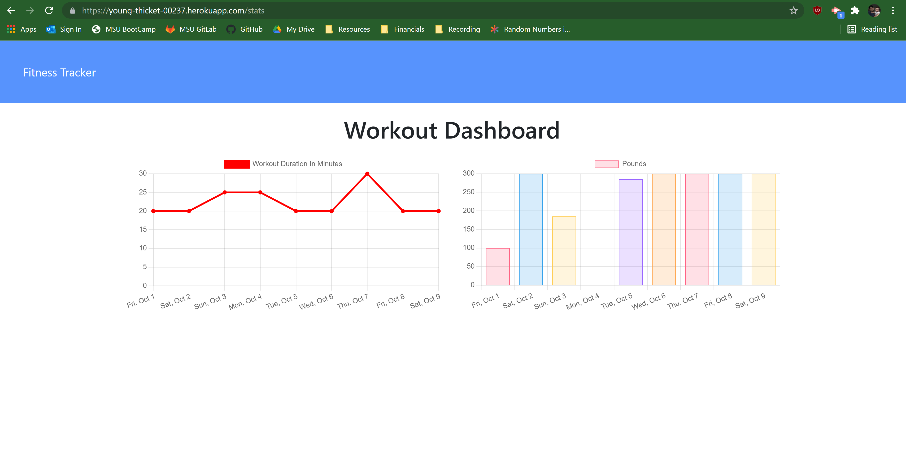

# Workout Tracker

## Badges

## Description
A fitness tracking app that saves user workout data in a NoSQL database with  MongoDB and renders the data with ChartJS.

## Table of Contents
  
- [Installation](#installation)
- [Questions](#questions)
- [License](#license)

## Installation
Visit https://young-thicket-00237.herokuapp.com/ to demo.

## Questions
If you have any questions you can reach me at klcbusiness@hotmail.com or via [GitHub](https://github.com/kevinchewning).

## License
MIT
https://opensource.org/licenses/MIT
